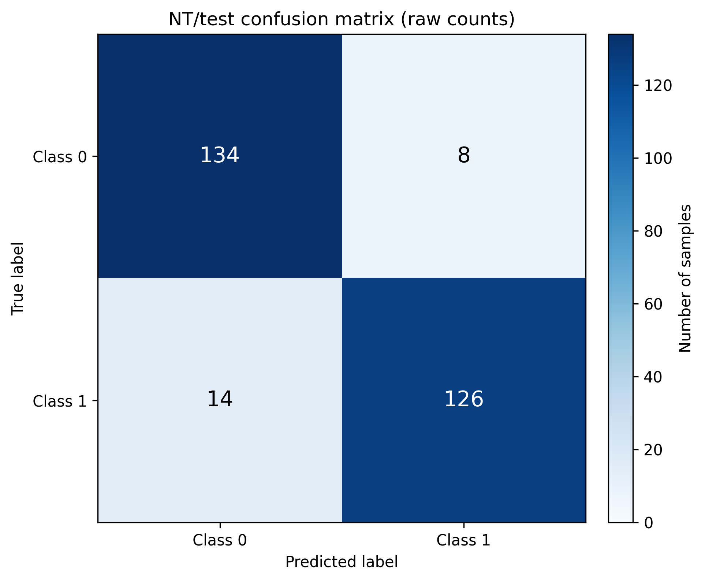
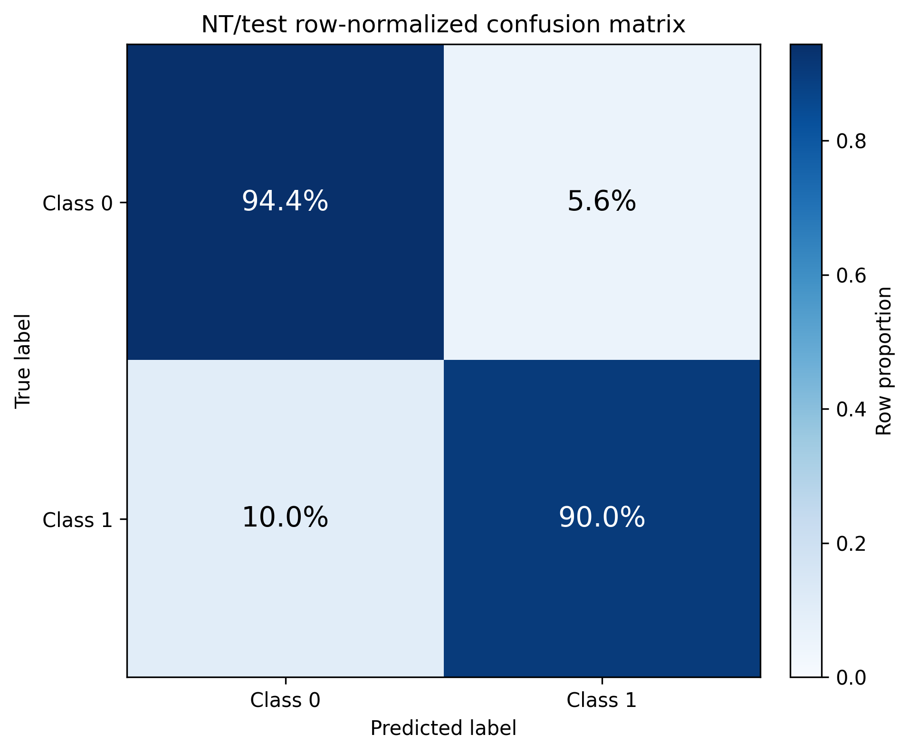
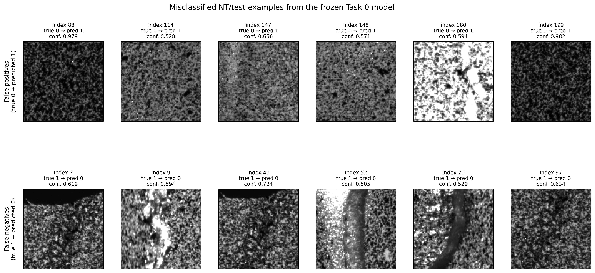

# Task 4: Confusion Matrix Analysis

This task evaluates the frozen Task 0 NT checkpoint on `NT/test`. It does not train or
modify the model. The script restores the architecture and preprocessing from checkpoint
metadata, evaluates the 282 test samples once in index order, and derives every artifact
from those predictions.

## Reproduction command

Run from the repository root on Windows:

```powershell
conda run -n cnn_project python .\tasks\task_4_confusion_matrix\analysis.py --checkpoint tasks/task_0_baseline_cnn/results/best_model.pt --reference-metrics tasks/task_0_baseline_cnn/results/metrics.json --device cpu --batch-size 64 --workers 0 --max-per-error 6 --output-dir tasks/task_4_confusion_matrix/results
```

`--device auto` may be used to select CUDA when it is available. Relative paths are
resolved from the repository root, not from the caller's working directory.

## Results

Overall accuracy is **92.20%** (`260/282`). The raw confusion matrix uses rows as true
labels and columns as predicted labels:

| True / predicted | Class 0 | Class 1 | Support |
|---|---:|---:|---:|
| Class 0 | 134 | 8 | 142 |
| Class 1 | 14 | 126 | 140 |





| Scope | Precision | Recall | F1-score | Support |
|---|---:|---:|---:|---:|
| Class 0 | 90.54% | 94.37% | 92.41% | 142 |
| Class 1 | 94.03% | 90.00% | 91.97% | 140 |
| Macro average | 92.29% | 92.18% | 92.19% | 282 |
| Weighted average | 92.27% | 92.20% | 92.19% | 282 |

The class supports are almost balanced, which is why macro and weighted results are nearly
identical.

## Error analysis

### Observed evidence

- Class 1 is harder under recall and F1: 10.0% of true class-1 samples are predicted as
  class 0, compared with 5.6% of true class-0 samples predicted as class 1. There are 14
  false negatives and 8 false positives.
- Class 1 nevertheless has higher precision (94.03%). When the model predicts class 1,
  that prediction is less often wrong than a class-0 prediction.
- The inspected gallery contains the first six false positives at indices
  `88, 114, 147, 148, 180, 199` and the first six false negatives at indices
  `7, 9, 40, 52, 70, 97`. These stable indices are also recorded in `metrics.json`.
- The selected false positives do not share one clear global appearance: indices 88 and
  199 are dark, index 180 is much brighter, and the remaining examples have intermediate
  intensity and texture.
- Several selected false negatives contain a pronounced high-contrast structure or band
  through the central region. Indices 7 and 40 also contain a large dark upper boundary,
  while index 97 is less visually extreme. This pattern is therefore recurring in the
  selected row, but not universal.



### Hypotheses and possible improvements

The gallery alone cannot establish why the model failed. One plausible hypothesis is that
large illumination changes, central bands, or image boundaries disrupt texture cues learned
by the baseline CNN. This should be tested rather than treated as a causal conclusion.

Potential follow-up experiments are:

- apply brightness, contrast, and spatial augmentations to `NT/train` only, selecting their
  settings with `NT/val`;
- standardize the field of view or test a justified crop/segmentation step, after confirming
  that removed boundaries are not label information;
- use hard examples found in training or validation data for additional training, without
  feeding these test errors back into model selection;
- if class-1 recall is operationally more important, tune the class-1 decision threshold on
  validation data and then evaluate the locked threshold once on test data;
- collect more labeled training examples resembling the high-contrast and boundary cases.

## Verification

The analysis stops with an error unless all checks pass. For this run:

- confusion-matrix total: `282`;
- NT test-set size: `282`;
- accuracy from the diagonal: `260 / 282 = 0.9219858156028369`;
- Task 0 reference accuracy: `0.9219858156028369`;
- fresh matrix and accuracy both match the Task 0 result exactly.

## Artifacts

- `analysis.py` — reproducible evaluation and artifact generation.
- `results/predictions.csv` — all 282 indices, labels, both class probabilities,
  predicted-class confidence, correctness, and error type.
- `results/metrics.json` — full metrics, both matrices, all error indices, gallery indices,
  checkpoint identity, preprocessing, and verification checks.
- `results/metrics.csv` — per-class, macro, weighted, and overall metrics.
- `results/confusion_matrix_counts.png` — raw-count matrix.
- `results/confusion_matrix_normalized.png` — row-normalized matrix.
- `results/misclassified_gallery.png` — six false positives and six false negatives.

## Limitations

- This is one frozen architecture, training seed, checkpoint, and dataset.
- The gallery shows 12 of the 22 errors. It is readable and reproducible, but cannot prove
  that its visual patterns represent every failure.
- Softmax confidence is reported but has not been calibrated.
- Labels are numeric because no authoritative semantic class names were supplied.
- The test set is used only for final post-lock analysis; improvements proposed here require
  new training/validation experiments before another independent test evaluation.
