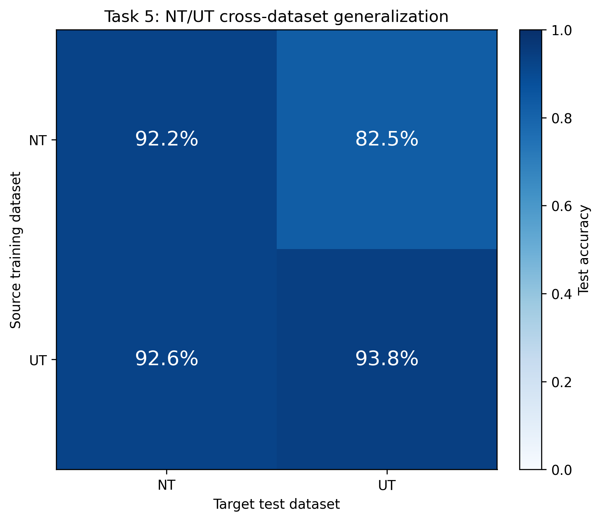

# Task 5: Cross-Dataset Generalization

This backup task measures transfer between the two datasets with valid labels. One baseline
CNN was trained on NT and one on UT with the same architecture, initialization seed, and
training protocol. Each checkpoint was selected only by minimum loss on its own source
validation split. Both checkpoints were locked before either test split was opened.

## Assignment interpretation and ASB exclusion

The authoritative assignment PDF states that ASB must not be used because its annotations
have systematic problems. Task 5 §4.6 lists the valid experiments as:

1. train on NT, test on UT;
2. train on UT, test on NT.

The same section still asks for a “3×3 accuracy table,” which contradicts both that two-domain
experiment list and the PDF's ASB warning. This implementation treats the 3×3 phrase as stale
wording and produces the valid 2×2 NT/UT matrix, including the two within-domain controls.
No separate written TA clarification was found in the repository, so none is claimed here.
ASB is never loaded by this script.

## Protocol

Both source runs used:

- the Task 0 `SimpleCNN` with channels `(16, 32, 64)`, ReLU, max pooling, and a two-class head;
- seed `42`, reset before each source run so both models start identically;
- Adam, learning rate `0.001`, batch size `64`, and cross-entropy loss;
- at most 30 epochs and early-stopping patience 6;
- checkpoint selection by minimum source-validation loss only;
- raw float32 `[0,1]` images with no augmentation or normalization.

The locked preprocessing is identity preprocessing (`normalization: null`). The exact same
checkpoint metadata is applied to both targets; there is no target-specific normalization.

## Exact commands

The smoke test used `--train-only`, so it validated both training/checkpoint paths without
opening NT/test or UT/test:

```powershell
$smoke = Join-Path $env:TEMP 'optml_task5_smoke_20260623'
conda run -n cnn_project python .\tasks\task_5_cross_dataset\cross_evaluation.py --seed 42 --epochs 1 --batch-size 64 --learning-rate 0.001 --device cpu --workers 0 --early-stopping-patience 1 --train-only --output-dir "$smoke"
```

The reported full run was:

```powershell
conda run -n cnn_project python .\tasks\task_5_cross_dataset\cross_evaluation.py --seed 42 --epochs 30 --batch-size 64 --learning-rate 0.001 --device cpu --workers 0 --early-stopping-patience 6 --output-dir tasks/task_5_cross_dataset/results
```

## Source-model training

| Source | Train samples | Validation samples | Epochs run | Selected epoch | Best validation loss | Best validation accuracy | Training time |
|---|---:|---:|---:|---:|---:|---:|---:|
| NT | 844 | 281 | 19 | 13 | 0.17684 | 90.39% | 83.64 s |
| UT | 528 | 176 | 30 | 29 | 0.11766 | 97.73% | 87.11 s |

NT stopped after six non-improving epochs. UT used the full common budget, with its selected
validation loss occurring at epoch 29.

## Generalization results

Rows are source training datasets and columns are target test datasets:

| Source \ Target | NT/test | UT/test |
|---|---:|---:|
| **NT** | **92.20%** | **82.49%** |
| **UT** | **92.55%** | **93.79%** |



Detailed results:

| Source→Target | Accuracy | Loss | Confusion matrix (rows=true) |
|---|---:|---:|---|
| NT→NT | 92.20% | 0.18987 | `[[134, 8], [14, 126]]` |
| NT→UT | 82.49% | 0.31238 | `[[76, 16], [15, 70]]` |
| UT→NT | 92.55% | 0.24311 | `[[134, 8], [13, 127]]` |
| UT→UT | 93.79% | 0.23166 | `[[86, 6], [5, 80]]` |

## Domain-shift analysis

### Observed evidence

- Transfer is asymmetric. NT→UT is 9.71 percentage points below NT→NT and 11.30 points
  below the UT-trained model on UT. It makes 31 errors instead of UT→UT's 11.
- NT→UT does not collapse onto one class: it has 16 class-0 errors and 15 class-1 errors,
  with recalls of 82.61% and 82.35%, respectively. The degradation affects both classes.
- UT→NT retains 92.55% accuracy. Its confusion matrix differs from NT→NT by one class-1
  prediction, so its 0.35-point advantage is only one test image and should not be treated
  as evidence that UT training is universally superior.
- The NT history plateaus and oscillates after its selected epoch. The UT validation loss
  generally continues downward toward the end of the 30-epoch budget. Both plots were
  inspected after generation.

### Interpretation and hypotheses

The results provide direct evidence of an NT-to-UT distribution shift, because the same
frozen NT model and preprocessing perform substantially worse when only the test domain
changes. The strong UT→NT result suggests that features learned from UT overlap well with
those needed for NT in this run. A plausible hypothesis is that UT exposes the network to
visual variability that also occurs in NT, while the reverse coverage is incomplete.
Accuracy alone cannot identify whether the shift comes from texture, contrast, acquisition,
or another image property; those explanations require dedicated distribution and feature
analyses.

## Leakage verification

`results/leakage_audit.json` records the following passing checks:

- only NT/train and NT/val were opened while training the NT model;
- only UT/train and UT/val were opened while training the UT model;
- both checkpoint files and hashes were locked before any test load;
- checkpoint hashes were unchanged after all four evaluations;
- each source's preprocessing fingerprint was identical for its NT and UT targets;
- no test metric enters training, early stopping, checkpoint selection, preprocessing, or
  hyperparameter selection;
- no target-specific tuning and no ASB access occurred.

## Artifacts

- `cross_evaluation.py` — complete training, locking, evaluation, and audit pipeline.
- `results/experiment_config.json` — shared protocol, software, command, and PDF interpretation.
- `results/NT/` and `results/UT/` — `best_model.pt`, `run_config.json`, `history.csv`, and
  `training_curves.png` for each source.
- `results/raw_metrics.json` — full metrics, per-class results, confusion matrices, checkpoint
  identities, and preprocessing metadata for all four evaluations.
- `results/raw_metrics.csv` — flat source-target metric table.
- `results/accuracy_matrix.csv` — the 2×2 accuracy matrix.
- `results/accuracy_heatmap.png` — publication-ready matrix visualization.
- `results/leakage_audit.json` — machine-readable split, hash, preprocessing, and tuning checks.

## Limitations

- Results use one seed and one baseline architecture; transfer uncertainty across retraining
  seeds was not measured.
- NT/test has 282 samples and UT/test has 177, so small percentage differences can represent
  only one or two images.
- UT did not trigger early stopping and selected epoch 29, so a larger common budget could
  change its result. Increasing only UT's budget after seeing test metrics would be invalid.
- Identity preprocessing leaves acquisition-related intensity differences uncorrected, but
  avoids target-derived normalization statistics.
- No domain adaptation was attempted, and the accuracy matrix does not by itself reveal the
  physical cause of the domain shift.
- These test results are strictly post-lock analysis. Any follow-up model or preprocessing
  choice must be developed using training/validation data, not these test outcomes.
